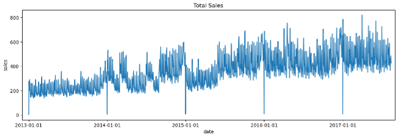
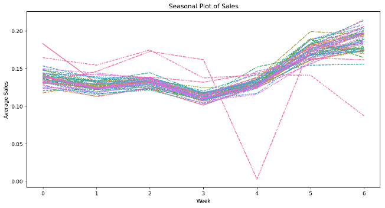
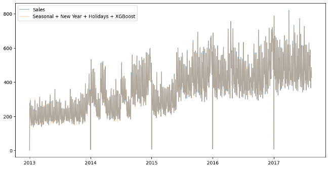

# Store Sales Time Series Forecasting

## Data Preparation

1. **Loading the Data:**
   - The data includes various columns like `store_nbr`, `family`, `date`, `sales`, and `onpromotion`.
   - The date column is parsed and set as the index, and the data is sorted by `store_nbr`, `family`, and `date`.

2. **Data Aggregation:**
   - Sales data is aggregated to get the daily average sales.
   - Missing values are handled, and data is prepared for further analysis.

## Exploratory Data Analysis (EDA)

1. **Visualizing Sales Trends:**
   - A line plot is created to visualize the overall sales trend over time.
   - Sales show seasonal patterns with an observable annual seasonality.

2. **Seasonality Analysis:**
   - Seasonal patterns are analyzed using both monthly and weekly data.
   - Weekly seasonality and annual seasonality are identified.

3. **Periodogram:**
   - A periodogram is plotted to identify significant frequencies in the time series data, confirming the presence of annual and weekly seasonality.

## Feature Engineering

1. **Deterministic Process:**
   - Calendar Fourier terms are added to capture annual seasonality.
   - A linear trend and weekly seasonality are also modeled.

2. **Holidays as Features:**
   - National and regional holidays are added as features to capture their impact on sales.

3. **Lag Features:**
   - Lag features are created to capture the autocorrelation in the sales data.

## Modeling

1. **Linear Regression:**
   - A linear regression model is trained with the engineered features, including the seasonal and holiday features.

2. **XGBoost Model:**
   - After detrending the data, an XGBoost model is applied to capture more complex patterns in the residuals.

3. **Hybrid Model:**
   - A hybrid approach is used, combining the XGBoost predictions with the linear model to improve accuracy.
  

## Evaluation

1. **Metrics:**
   - The models are evaluated using Root Mean Squared Logarithmic Error (RMSLE) and Root Mean Squared Error (RMSE).
   - The final hybrid model shows significant improvement in forecasting accuracy. RMSEL decreases from  0.28 to 0.032.

## Conclusion

This project demonstrates a comprehensive approach to time series forecasting by combining traditional statistical methods with machine learning techniques. The use of feature engineering, including seasonality and holiday effects, along with advanced models like XGBoost, provides a robust framework for forecasting store sales.

## Future Work

The next step will be fine-tuning the model to prevent overfitting on training data.

